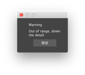
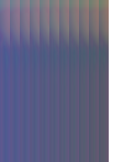

# VertexAnimationTextureMaya
頂点アニメーションをテクスチャにベイクするMayaプラグインです。

## インストール
### DragAndDrop
"VertexAnimationTextureMaya.mel" ファイルをMayaのウィンドウにドラッグアンドドロップします。 
> Drag and drop "maya_module_plugin_sample.mel" into the maya window

### modファイルの移動
Mayaを再起動してください。
> RestartMaya:Implementing so that it can be installed without rebooting...

## 起動
メニューバー→VertexAnimationTexture→OpenWindow
より本ツールのウィンドウを開きます。

## 使い方
1.ドロップダウンメニューから、ベイクするMeshを選択します。  
2.detailスライダーにて、ベイク精度を調整します。  
3.ベイク時間をタイムレンジで設定します。  
4.出力先するテクスチャのパスを設定します。  
5.Executeボタンよりベイクを実行します。

## ベイク精度
detailスライダーにて適切なベイク精度を設定する必要があります。  
精度が高すぎる場合はエラーのポップアップが表示されるので、精度を下げて再度実行してください。  
精度が低すぎる場合はグレーに近い画像が出力されますので、精度を上げて再度実行してください。

精度設定はUnityでも用いますので、メモしておいてください。

| 高精度 | 適正精度 | 低精度 |
|-----------|------------|------------|
|  |  |  |

## Unity実行環境
以下のリポジトリにサンプルを用意しています。  
https://github.com/salt-k2t/VertexAnimationTextureUnity  
https://github.com/salt-k2t/VertexAnimationTextureUnityShaderGraph

# Reference
https://github.com/salt-k2t/maya_module_plugin_sample  
https://github.com/robertjoosten/maya-module-installer
